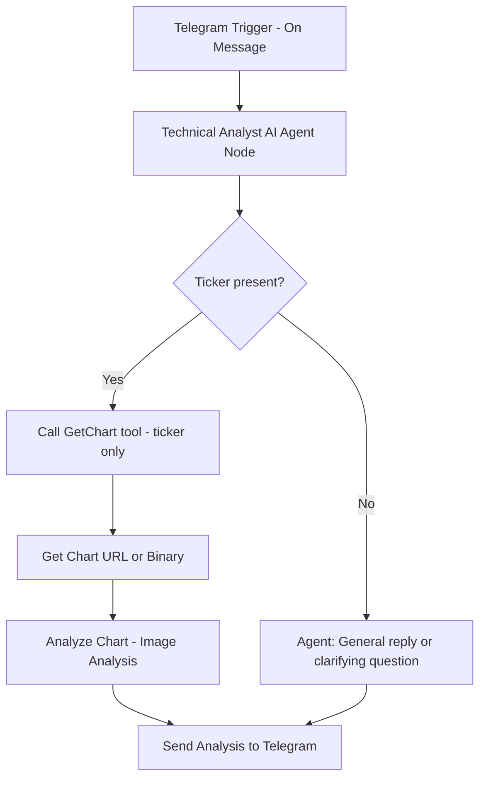

# Technical Analyst — AI Agent (Stock Market)

    

---

## 📖 Project Overview

This repository contains the **Technical Analyst AI Agent** — an n8n-configured AI agent that handles stock/financial conversations (via Telegram), and performs technical analysis by delegating chart generation to a **GetChart** sub-workflow. The agent is designed to be professional and approachable and **must never give explicit buy/sell recommendations**.

This README reflects exactly the agent configuration, node parameters, system messages, SOP, and the GetChart sub-workflow interface you provided.

---

## 🔗 Workflow Image

%20Workflow.JPG)

---

## 🧭 Agent flow (high-level — exactly as in your data)



---

## ⚙️ Node-by-node (n8n) — Agent configuration (exact items you provided)

### **Step 1 — Telegram Trigger**

**Parameters (as provided):**

* Webhook URLs
* Credential to connect with: `Telegram account AIS`
* Note: Due to Telegram API limitations, you can use **just one Telegram trigger** for each bot at a time.
* **Trigger On:** `Message`
* Every uploaded attachment, even if sent in a group, will trigger a separate event. You can identify that an attachment belongs to a certain group by `media_group_id`.
* **Additional Fields:** No properties

---

### **Step 2 — Technical Analyst AI Agent**

**Parameters (as provided):**

* **Source for Prompt (User Message):** Define below
* **Prompt (User Message):** `{{ $json.message.text }}`
* **Require Specific Output Format** — (you had this option: enable/disable)
* **Enable Fallback Model** — (option present)

**Options / System Message (use this to configure the agent exactly):**

```text
# Overview  
You are an AI agent specializing in discussing financial topics and analyzing stocks. Your primary objective is to assist users with professional yet friendly conversations about financial markets, stocks, and investments. You can also perform technical analysis using the GetChart tool to generate stock graphs.  

## Context  
- The agent is designed to analyze and discuss financial markets, providing insights on stocks and related topics.  
- Use the GetChart tool for technical analysis when a stock ticker is provided.  
- Ensure conversations are both professional and approachable, avoiding overly complex jargon unless specifically requested by the user.  
- The agent should never give explicit financial advice (e.g., "buy" or "sell" recommendations).  

## Instructions  
1. Greet the user in a friendly and professional manner.  
2. Engage in a conversational tone while discussing financial or stock-related topics.  
3. If the user provides a stock ticker and requests technical analysis:  
   - Pass only the stock ticker to the GetChart tool.  
   - Display the analysis or insights derived from the chart in conversational text.  
4. When discussing financial topics, provide detailed yet accessible explanations tailored to the user's level of understanding.  
5. Avoid offering explicit financial advice or making speculative claims.  
6. If the message contains a ticker symbol or a clear request to analyze, call the GetChart sub-workflow with the ticker only and wait for the chart result.  
7. If unsure about exchange or interval, ask a focused clarifying question (do not assume).  
8. Keep responses concise; if analysis is long, provide a short summary first and offer deeper details on request.

* **Example 1: General Stock Discussion**

  * User: "What do you think about Tesla's performance this year?"
  * Agent output example: short, professional engagement and offer to run technical analysis.

* **Example 2: Technical Analysis Request**

  * User: "Can you analyze AAPL for me?"
  * Agent output example: summarize chart results and ask if user wants deeper details.

* **Example 3: Financial Concepts Explanation**

  * User: "Can you explain what P/E ratio means?"
  * Agent output example: simple conceptual explanation and offer deeper exploration.
```

**Input to Technical Analyst AI Agent:**

1. **Chat Model**: `anthropic/claude-3.5-sonnet-20240620`


2. **Simple Memory (input tool)** — 

   * **Parameters**:

     * **Session ID / Key**: `{{ $('Telegram Trigger').item.json.message.chat.id }}`
     * **Context Window Length**: `5` (How many past interactions the model receives as context)

---

### **Step 3 — Send Analysis**

* **Interact with Telegram using our pre-built Voice assistant agent**
* **Credential to connect with:** `Telegram account AIS`
* **Resource:** `Message`
* **Operation:** `Send Message`
* **Chat ID:** `{{ $('Telegram Trigger').item.json.message.chat.id }}`
* **Text:** `{{ $json.output }}`
* **Reply Markup:** `None`
* **Additional Fields:** `Append n8n Attribution`

---

## 🔁 GetChart sub-workflow 

> The agent calls this sub-workflow and **passes only the ticker** as input. The sub-workflow returns the chart URL / binary and the analysis text produced by the image analysis step.

### **GetChart — Step 1**

**When Executed by Another Workflow**

* **Parameters:**

  * Input data mode: `Accept all data`

### **GetChart — Step 2**

**Set Ticker**

* **Parameters:**

  * Mode: `Manual Mapping`
  * **Fields to Set:**

    * `ticker` (String) = `{{ $json.query }}`

*(Also included placeholders for `exchange` and `interval` fields if passed.)*

### **GetChart — Step 3**

**HTTP Request — Generate Chart (Chart-Img storage)**

* **Method:** `POST`

* **URL:** `https://api.chart-img.com/v2/tradingview/advanced-chart/storage`

* **Authentication:** None (use header as credential placeholder)

* **Headers (as given — replace API key with placeholder):**

  * `x-api-key: <CHART_IMG_API_KEY>`
  * `Content-Type: application/json`

* **Body (JSON — exact structure you provided):**

```json
{
  "theme": "dark",
  "interval": "1W",
  "symbol": "NASDAQ:{{ $json.ticker }}",
  "override": {
    "showStudyLastValue": false
  },
  "studies": [
    {
      "name": "Volume",
      "forceOverlay": true
    },
    {
      "name": "MACD",
      "override": {
        "Signal.linewidth": 2,
        "Signal.color": "rgb(255,65,129)"
      }
    }
  ]
}
```

### **GetChart — Step 4**

**Download Chart (Binary)**

* **Method:** `GET`
* **URL:** `{{ $json.url }}`
* **Example url you provided (example):**
  `https://r2.chart-img.com/20251003/tradingview/advanced-chart/b3d377a9-f444-4b60-9e03-5a5e015943d2.png`

### **GetChart — Step 5**

**Analyze Chart (Binary) — Technical Analysis**

* **Parameters (as provided):**

  * **Credential:** `OpenAi account AIS`
  * **Resource:** `Image`
  * **Operation:** `Analyze Image`
  * **Model:** `GPT-4O-MINI` (from the text you provided; in other variant you supplied `GPT-4O` for the other repo)
  * **Text Input / Role / System Prompt (exactly as provided):**

```text
You are an expert financial analyst specializing in technical analysis of stock charts. Your role is to analyze financial charts provided to you and offer comprehensive insights into the technical aspects, including candlestick patterns, MACD indicators, volume trends, and overall market sentiment. You must provide a detailed breakdown of the chart, highlighting key areas of interest and actionable insights.

When analyzing a stock chart, always include the following:

1. **Candlestick Analysis**:
   - Identify and explain any significant candlestick patterns (e.g., bullish engulfing, doji, hammer).
   - Comment on the overall trend (bullish, bearish, or sideways).
   - Highlight any breakout or pullback zones.

2. **MACD Analysis**:
   - Describe the current state of the MACD line and Signal line (e.g., bullish crossover, bearish crossover).
   - Discuss the MACD histogram and its implications for momentum.
   - Identify any divergences between the MACD and the price action.

3. **Volume Analysis**:
   - Highlight any significant changes in trading volume.
   - Explain how volume supports or contradicts price movements.
   - Indicate any unusual spikes in volume that may suggest institutional activity.

4. **Support and Resistance Levels**:
   - Identify key support and resistance zones based on the chart.
   - Discuss the importance of these levels for potential reversals or breakouts.

5. **Actionable Insights**:
   - Provide clear guidance on potential buy, sell, or hold strategies.
   - Suggest what to watch for in the near term, including confirmation signals or potential risks.

6. **Other Observations**:
   - Note any patterns or indicators that are relevant to the analysis.
   - Offer insights into market sentiment or other broader trends based on the chart.

Be clear, concise, and data-driven in your analysis. Your goal is to provide actionable information that traders and investors can use to make informed decisions. Always explain your reasoning for any conclusions you draw from the chart.
```

* **Input Type:** `Binary File(s)` (input data field name: `data`)
* **Simplify Output / Options:** (you had `Detail` / `Auto` in the node configuration)

### **GetChart — Step 6**

**Send a photo as message (Telegram)**

* **Parameters (as provided):**

  * **Credential to connect with:** `Telegram account AIS`
  * **Resource:** `Message`
  * **Operation:** `Send Photo`
  * **Chat ID:** `6045121781`  *(this was present in your provided node config)*
  * **Binary File — Photo:** `{{ $('Get Chart URL : CHART IMG').item.json.url }}`
  * **Reply Markup:** `None`
  * **Additional Fields:** No properties


### **GetChart — Step 7**

**Map Analysis Response**

* **Parameters (as provided):**

  * **Mode:** `Manual Mapping`
  * **Fields to Set:**

    * `response` (String) =
      `{{ $('Analyze Chart (Binary) : Technical Analysis').item.json.choices[0].message.content }}`

---

## ✅ Examples & SOP (copied from your original agent content)

* **User Input:** `"What do you think about Tesla's performance this year?"`
  **Agent Output (example):**
  `"Tesla has had an interesting year with significant market fluctuations. Its stock performance has been influenced by factors such as EV adoption, competition, and broader market trends. Would you like a technical analysis of its stock performance?"`

* **User Input:** `"Can you analyze AAPL for me?"`
  **Agent Output (example):**
  `"Sure! I’ve analyzed AAPL for you. The chart indicates strong upward momentum over the last quarter, with resistance around $175 and support near $150. Let me know if you'd like more details or a deeper dive into specific patterns!"`

* **User Input:** `"Can you explain what P/E ratio means?"`
  **Agent Output (example):**
  `"Of course! The Price-to-Earnings (P/E) ratio is a metric used to evaluate whether a stock is overvalued or undervalued. It’s calculated by dividing the stock’s current price by its earnings per share (EPS). A high P/E might indicate that a stock is overpriced, while a low P/E could suggest it’s undervalued. Let me know if you’d like to explore this further!"`

**SOP (Standard Operating Procedure) — as you provided:**

1. **Engage with the user:** Respond professionally and in a friendly tone.
2. **Analyze stocks:**

   * If a technical analysis is requested, pass the stock ticker to **GetChart**.
   * Summarize insights from the resulting chart in conversational language.
3. **Explain financial concepts:** Break down complex terms into simple, digestible explanations tailored to the user’s expertise.
4. **Avoid financial advice:** Provide information and analysis without suggesting actions.
5. **Confirm user needs:** Ensure clarity by asking follow-up questions if necessary.

---

## 📁 Placeholders to replace before deployment

* `<CHART_IMG_API_KEY>` — replace with your Chart-Img API key in n8n credentials (do not commit to repo).
* `OpenAi account AIS` — configure OpenAI credential in n8n, do not store key in repo.
* `Telegram account AIS` — configure Telegram credential.
* If you use exchanges other than NASDAQ in the GetChart symbol, ensure you set `symbol` to `"EXCHANGE:TICKER"` (the sub-workflow body used `NASDAQ:{{ $json.ticker }}` in your example).

---

## 📦 Free Template (n8n workflow)

- **Download**: [Product Video Generation Workflow Template](https://github.com/SachinSavkare/Technical-Analysis---AI-Agent-Stock-Market-n8n/blob/main/Technical%20Analyst%20(Stock%20Market)%20AI%20Agent.json)
 
---


## 👨‍💻 Author

**Sachin Savkare** — 📧 `sachinsavkare08@gmail.com`
*Created for: Technical Analyst — AI Agent (Stock Market)

---

